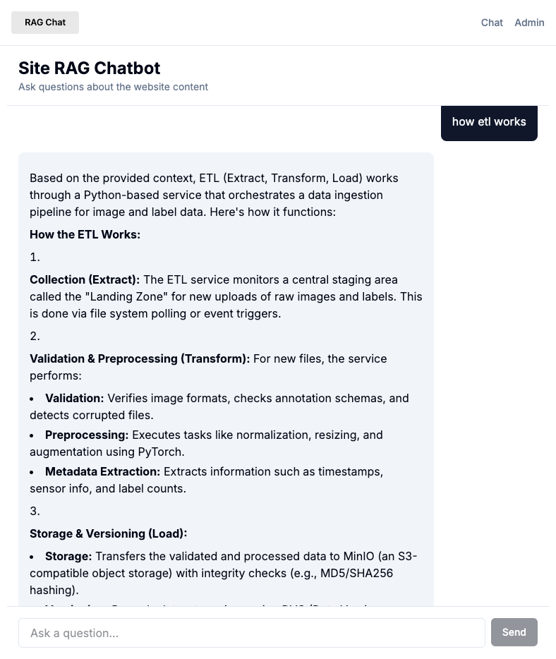
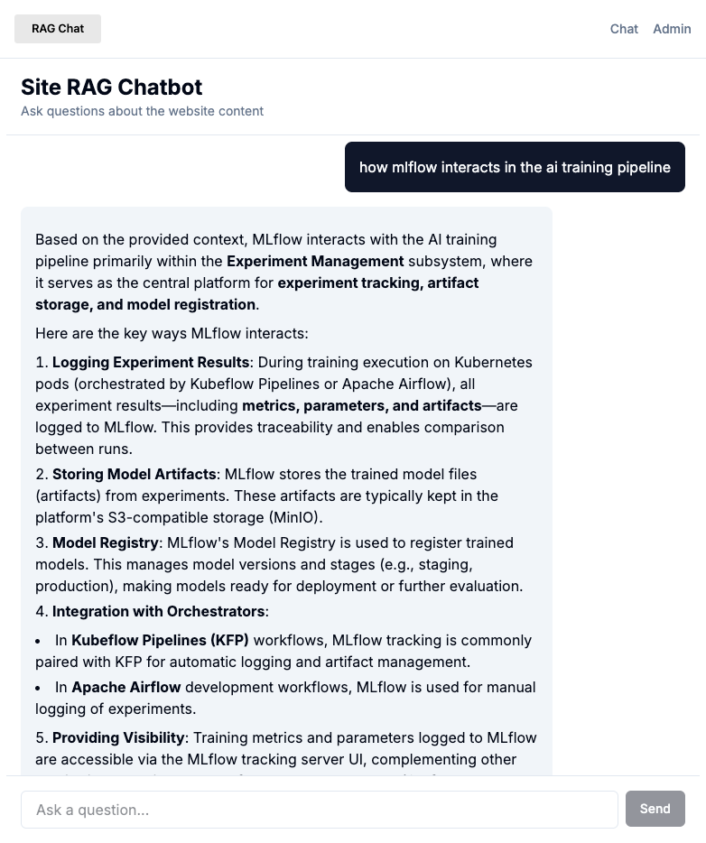
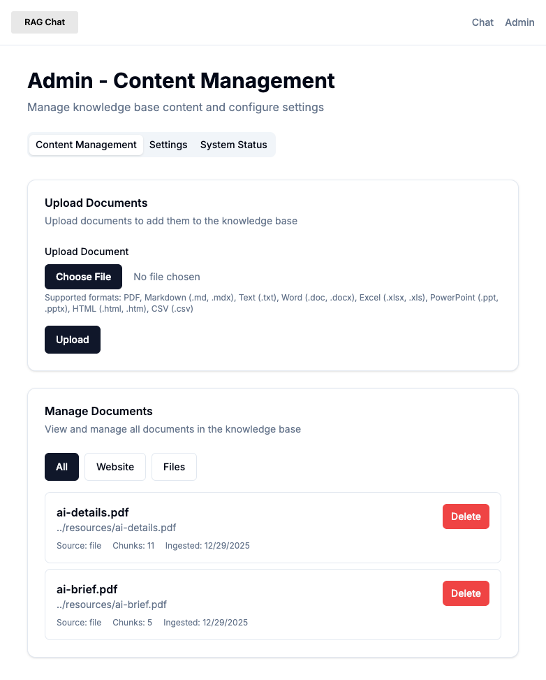
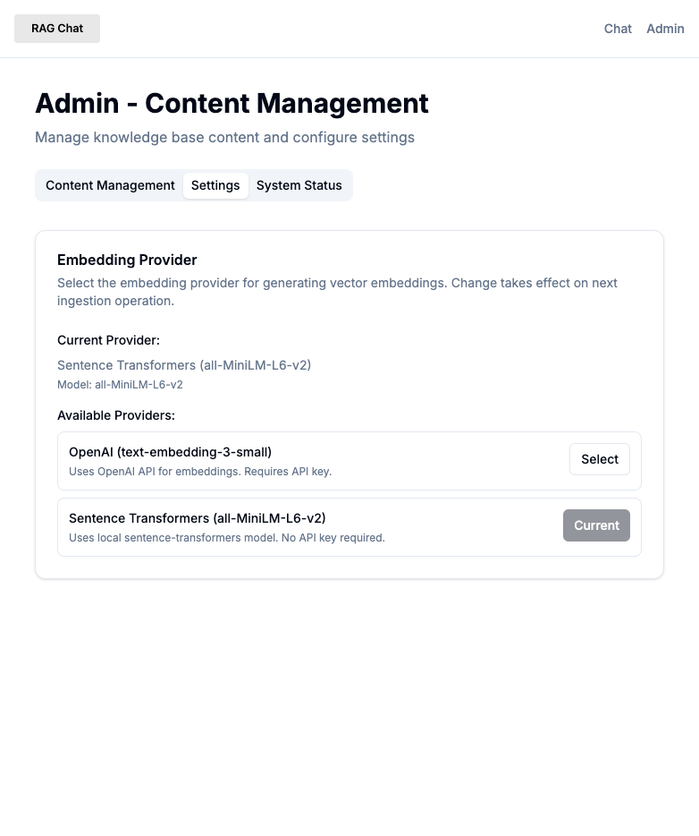
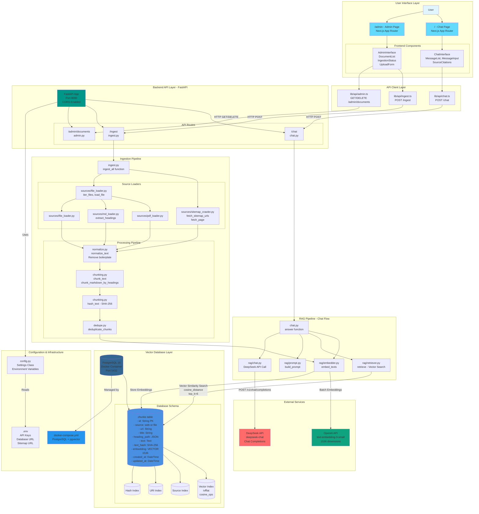
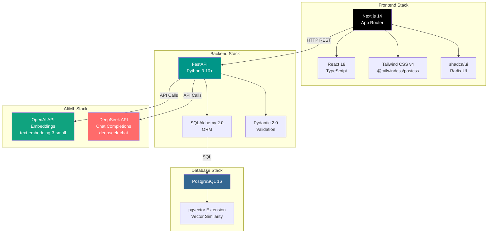
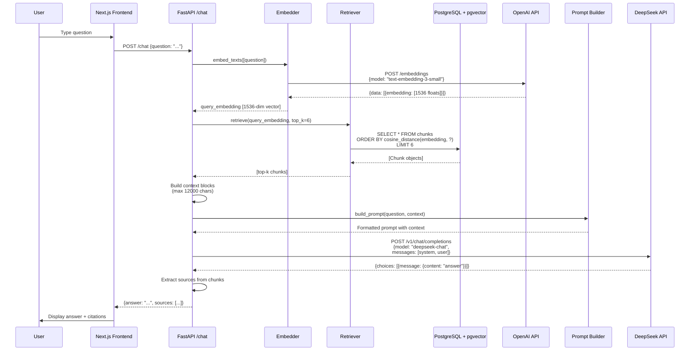
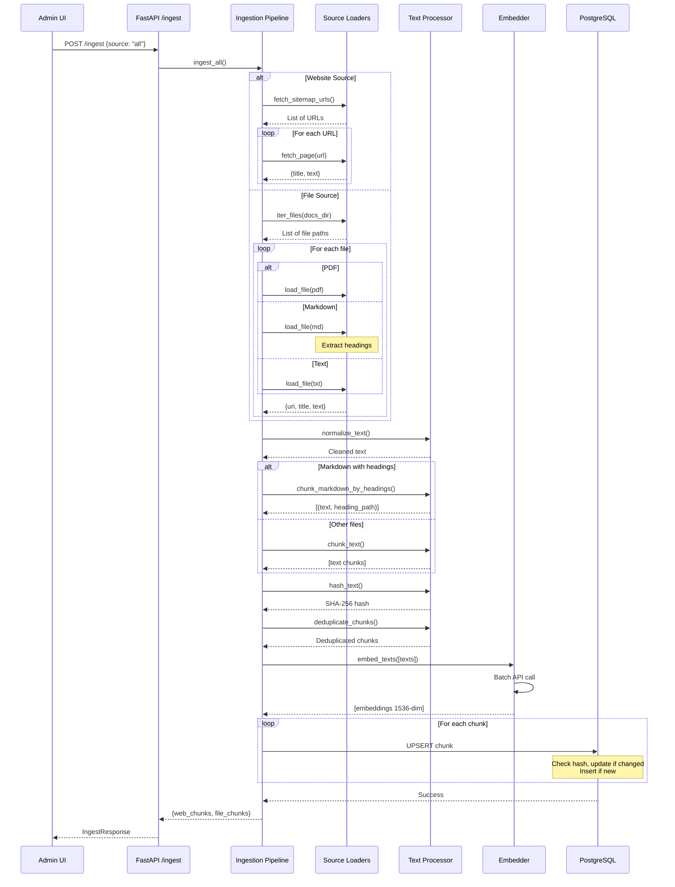

# Site RAG Chatbot

A RAG (Retrieval Augmented Generation) chatbot application that ingests content from static websites and documents, and provides a web-based chatbot interface for users to ask questions and receive answers with source citations.

## 🚀 Quick Overview

1. **Upload & Train Documents**: In the `/admin` page, upload documents in various formats (PDF, Markdown, TXT, etc.), then click 'Upload' to automatically process and train the system with your content.

2. **Chat with Your Documents**: From the `/chat` page, you can directly ask questions and chat with the newly uploaded documents. The system uses RAG to provide accurate answers with source citations.

3. **Manage Your Knowledge Base**: Remove documents from the `/admin` page at any time to train and chat with different sets of resources. This allows you to customize your knowledge base for different use cases.

## 🎯 Status

**Core Implementation**: ✅ Complete  
**User Stories**: ✅ All 4 implemented (Chat, Ingestion, Admin, Site Improvements)  
**Tests**: ⏳ Pending (see [Implementation Summary](./docs/implementation-summary.md))

The system is fully functional and ready for use. See [docs/implementation-summary.md](./docs/implementation-summary.md) for detailed implementation documentation.

## Features

- **Chat Interface**: Ask questions and get answers based on ingested content
  - **Markdown Rendering**: Chat responses support rich markdown formatting with syntax highlighting for code blocks
  - **Professional UI**: Branded experience with logo and favicon
- **Content Ingestion**: Ingest content from static websites (via sitemap) and documents (.md, .pdf, .txt)
- **Heading-Aware Chunking**: Markdown files are chunked by semantic sections, preserving document structure
- **Vector Search**: Semantic search using PostgreSQL + pgvector
- **Source Citations**: All answers include source citations
- **Admin Interface**: Manage knowledge base content (view, filter, delete documents)
  - **Organized Layout**: Content organized into tabs (Content Management, Settings, System Status)
  - **Embedding Provider Selection**: Switch between OpenAI and local sentence-transformers embeddings

### Screenshots










## Tech Stack

- **Backend**: Python 3.10+, FastAPI, SQLAlchemy, pgvector, OpenAI Embeddings (text-embedding-3-small), Sentence Transformers (local), Deepseek API
- **Frontend**: Next.js 14, React, TypeScript, Tailwind CSS, shadcn/ui, react-markdown
- **Database**: PostgreSQL 16 with pgvector extension

## Quick Start

### Prerequisites

- Python 3.10+
- Node.js 18+
- Docker and Docker Compose
- OpenAI API key (for embeddings)
- Deepseek API key (for chat)

### Setup

1. **Start the database**:
   ```bash
   cd backend
   docker compose up -d
   ```

2. **Configure environment**:
   ```bash
   # Backend
   cd backend
   cp .env.example .env
   # Edit .env with your API keys
   
   # Frontend
   cd ../frontend
   cp .env.example .env.local
   ```

3. **Install dependencies**:
   ```bash
   # Backend
   cd backend
   python -m venv .venv
   source .venv/bin/activate
   
   # Option 1: Install from pyproject.toml (recommended)
   pip install -e .
   
   # Option 2: Install from requirements.txt
   pip install -r requirements.txt
   
   # For development (includes test tools)
   pip install -r requirements-dev.txt
   
   # Frontend
   cd ../frontend
   pnpm install
   ```

4. **Initialize database**:
   ```bash
   cd backend
   python -c "from src.db import init_db; init_db()"
   ```

5. **Start services**:
   ```bash
   # Backend (in one terminal)
   cd backend
   uvicorn src.app:app --reload --port 8000
   
   # Frontend (in another terminal)
   cd frontend
   pnpm run dev
   ```

6. **Ingest content** (optional, for testing):
   ```bash
   cd backend
   python scripts/ingest_once.py
   ```

7. **Open the app**: http://localhost:3000

## Architecture

### System Overview



### Technology Stack



## Project Structure

```
site-rag-chatbot/
├── backend/                    # FastAPI backend
│   ├── src/
│   │   ├── app.py             # FastAPI application
│   │   ├── config.py          # Configuration
│   │   ├── db.py              # Database models
│   │   ├── ingest/            # Ingestion pipeline
│   │   │   ├── pipeline.py
│   │   │   ├── chunking.py
│   │   │   └── sources/       # File loaders
│   │   ├── rag/               # RAG components
│   │   │   ├── embedder.py
│   │   │   ├── retriever.py
│   │   │   └── chat.py
│   │   └── api/               # API routes
│   ├── tests/                 # Tests (pending)
│   ├── scripts/
│   │   └── ingest_once.py
│   ├── pyproject.toml
│   └── docker-compose.yml
├── frontend/                   # Next.js frontend
│   ├── app/                   # Next.js App Router
│   │   ├── page.tsx            # Chat interface
│   │   └── admin/
│   │       └── page.tsx        # Admin interface
│   ├── components/
│   │   ├── chat/              # Chat components
│   │   └── admin/             # Admin components
│   ├── lib/
│   │   ├── api/               # API clients
│   │   └── utils/              # Utilities
│   └── package.json
├── docs/
│   ├── implementation-summary.md  # Detailed implementation docs
│   ├── chatgpt.md             # Original blueprint
└   └── variable.md            # Technology decisions
```

## API Endpoints

- `POST /chat` - Ask a question and get an answer
- `POST /ingest` - Trigger content ingestion
- `GET /admin/documents` - List ingested documents (with optional source filter)
- `DELETE /admin/documents/{id}` - Remove a document
- `GET /admin/config/embedding-provider` - Get current embedding provider configuration
- `PUT /admin/config/embedding-provider` - Update embedding provider preference


## Usage

### Chat Interface

1. Open http://localhost:3000
2. Type a question in the chat interface
3. Receive answers with source citations

### Admin Interface

1. Open http://localhost:3000/admin
2. **Content Management Tab**:
   - **Upload Documents**: Upload PDF, Markdown, or text files
   - **Manage Documents**: View, filter, and delete documents from the knowledge base
3. **Settings Tab**:
   - **Embedding Provider**: Select between OpenAI (text-embedding-3-small) or local sentence-transformers
   - Changes take effect on the next ingestion operation (no restart required)
4. **System Status Tab**:
   - **Ingest Content**: Click "Ingest All" to crawl website and process documents
   - Monitor ingestion status and progress

### Data Flow

#### Chat/RAG Workflow



#### Ingestion Workflow



### Configuration

Edit `backend/.env`:
- `SITEMAP_URL`: URL to your website's sitemap.xml
- `DOCS_DIR`: Path to directory containing .md, .pdf, .txt files
- `LLM_PROVIDER`: Provider name (e.g., "deepseek" or "openai")
- `OPENAI_BASE_URL`: Base URL for OpenAI-compatible API (e.g., "https://api.deepseek.com")
- `OPENAI_API_KEY`: Your API key for embeddings and chat
- `VECTOR_STORE`: Vector store type ("memory" for dev, "pgvector" for production)
- `EMBEDDING_PROVIDER`: Embedding provider ("openai" for text-embedding-3-small, "local" for sentence-transformers, or "" for auto-detect)
  - Can be updated via the admin interface (Settings tab) without restarting the backend

## Backend Dependencies

The backend uses **pyproject.toml** (modern Python standard) for dependency management. For convenience, `requirements.txt` files are also provided.

**View dependencies:**
- `backend/pyproject.toml` - Source of truth
- `backend/requirements.txt` - Production dependencies
- `backend/requirements-dev.txt` - Development dependencies (includes test tools)

**Install:**
```bash
cd backend
python -m venv .venv
source .venv/bin/activate
pip install -e .  # Or: pip install -r requirements.txt
```

See [backend/README.md](./backend/README.md) for more details.

## Development

### Running Tests

```bash
# Backend
cd backend
pytest

# Frontend
cd frontend
pnpm test
pnpm run test:e2e
```

### Code Quality

```bash
# Backend
cd backend
ruff check .
black .
mypy src/

# Frontend
cd frontend
pnpm run lint
```

## Documentation

- **[Implementation Summary](./docs/implementation-summary.md)** - Detailed implementation documentation, architecture, design decisions, and future enhancements
- **[Site Improvements](./docs/004-site-improvements.md)** - Documentation for UI improvements and embedding provider selection
- **[API Contract](./specs/001-rag-chatbot/contracts/api.yaml)** - OpenAPI specification (core features)
- **[API Contract (Site Improvements)](./specs/004-site-improvements/contracts/api.yaml)** - OpenAPI specification (embedding provider config)
- **[Feature Specification](./specs/001-rag-chatbot/spec.md)** - Original feature requirements
- **[Site Improvements Specification](./specs/004-site-improvements/spec.md)** - Site improvements feature requirements
- **[Quickstart Guide](./specs/001-rag-chatbot/quickstart.md)** - Step-by-step setup instructions

## Implementation Details

### Completed Features

✅ **User Story 1 - Chat Interface**
- RAG pipeline (embedding, retrieval, generation)
- Chat UI with message history
- Source citations
- Loading states and error handling

✅ **User Story 2 - Content Ingestion**
- Website crawling via sitemap
- File loaders (PDF, Markdown, TXT)
- Heading-aware chunking for markdown files
- Chunking and embedding pipeline
- Incremental updates with change detection

✅ **User Story 3 - Admin Interface**
- Document listing with filtering
- Document deletion
- Ingestion controls
- Organized tabbed interface (Content Management, Settings, System Status)

✅ **User Story 4 - Site Improvements**
- Logo and favicon for branded experience
- Markdown rendering in chat responses with syntax highlighting
- Admin page reorganization with shadcn/ui tabs
- Embedding provider selection (OpenAI or local sentence-transformers)

### Pending Work

- Comprehensive test suite (unit, integration, E2E)
- Performance optimizations (caching, query optimization)
- File upload handler (multipart/form-data)
- Additional polish and enhancements

See [Implementation Summary](./docs/implementation-summary.md) for complete details.

## Troubleshooting

### Database Connection Issues

If you see `psycopg.OperationalError: connection refused`:
```bash
cd backend
docker compose ps  # Check if database is running
docker compose restart  # Restart if needed
```

### API Key Errors

Ensure your `backend/.env` file has valid API keys:
- `OPENAI_API_KEY` - Required for embeddings and chat (if using OpenAI-compatible provider)
- `OPENAI_BASE_URL` - Set to provider's base URL (e.g., "https://api.deepseek.com" for DeepSeek)
- `LLM_PROVIDER` - Set to "deepseek" or "openai" (defaults to "openai")

### No Answers Returned

1. Verify content has been ingested: Check `/admin/documents` endpoint
2. Ensure questions relate to ingested content
3. Check backend logs for embedding/retrieval errors

## Contributing

This is a feature implementation following the `/speckit` workflow. See `specs/001-rag-chatbot/` for specifications and design documents.

## License

MIT
