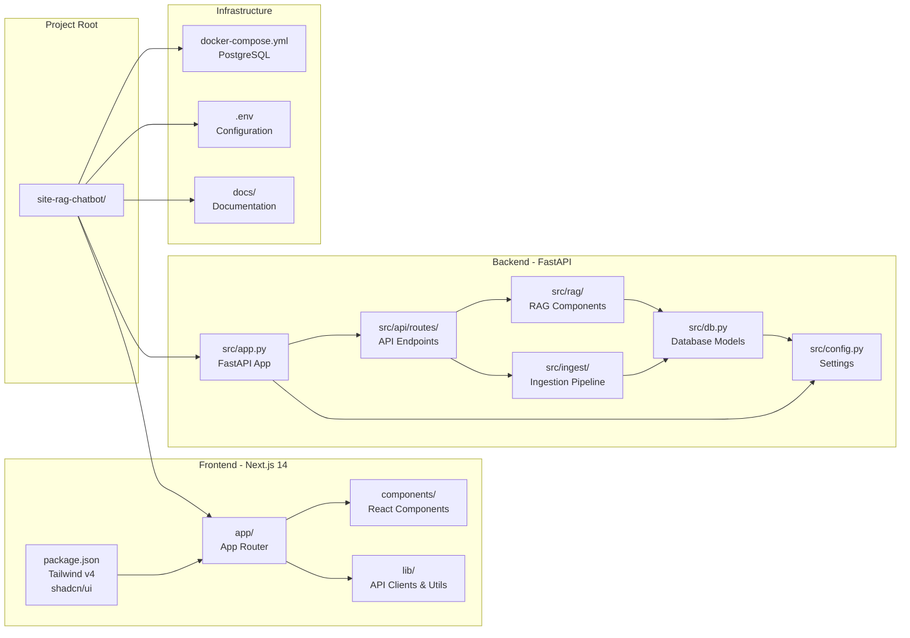
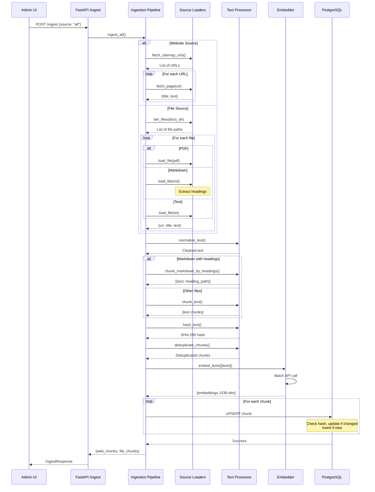
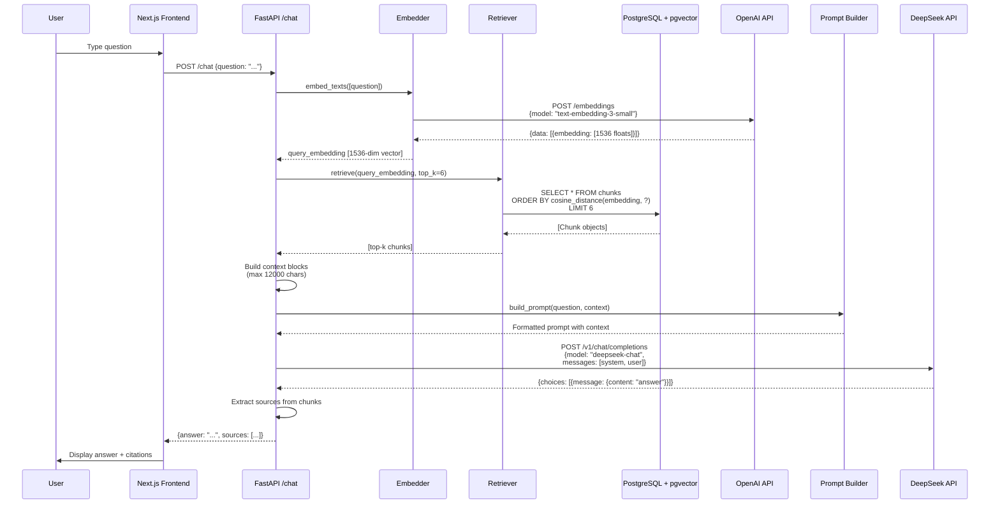
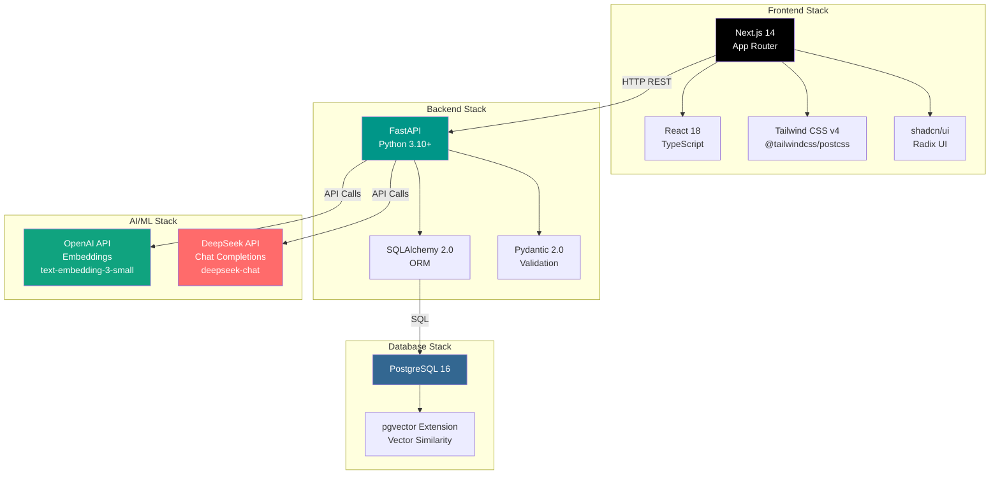

# Application Architecture & Workflow

## Complete System Workflow

```mermaid
flowchart TB
    subgraph "User Interface Layer"
        direction TB
        User[User]
        ChatPage["/ - Chat Page<br/>Next.js App Router"]
        AdminPage["/admin - Admin Page<br/>Next.js App Router"]
        
        subgraph "Frontend Components"
            ChatUI[ChatInterface<br/>MessageList, MessageInput<br/>SourceCitations]
            AdminUI[AdminInterface<br/>DocumentList<br/>IngestionStatus<br/>UploadForm]
        end
        
        User --> ChatPage
        User --> AdminPage
        ChatPage --> ChatUI
        AdminPage --> AdminUI
    end
    
    subgraph "API Client Layer"
        direction LR
        ChatAPI[lib/api/chat.ts<br/>POST /chat]
        IngestAPI[lib/api/ingest.ts<br/>POST /ingest]
        AdminAPI[lib/api/admin.ts<br/>GET/DELETE /admin/documents]
        
        ChatUI --> ChatAPI
        AdminUI --> IngestAPI
        AdminUI --> AdminAPI
    end
    
    subgraph "Backend API Layer - FastAPI"
        direction TB
        FastAPI[FastAPI App<br/>Port 8000<br/>CORS Enabled]
        
        subgraph "API Routes"
            ChatRoute["/chat<br/>chat.py"]
            IngestRoute["/ingest<br/>ingest.py"]
            AdminRoute["/admin/documents<br/>admin.py"]
        end
        
        ChatAPI -->|HTTP POST| ChatRoute
        IngestAPI -->|HTTP POST| IngestRoute
        AdminAPI -->|HTTP GET/DELETE| AdminRoute
        
        FastAPI --> ChatRoute
        FastAPI --> IngestRoute
        FastAPI --> AdminRoute
    end
    
    subgraph "RAG Pipeline - Chat Flow"
        direction TB
        ChatHandler[chat.py<br/>answer function]
        Embedder[rag/embedder.py<br/>embed_texts]
        Retriever[rag/retriever.py<br/>retrieve - Vector Search]
        PromptBuilder[rag/prompt.py<br/>build_prompt]
        ChatEngine[rag/chat.py<br/>DeepSeek API Call]
        
        ChatRoute --> ChatHandler
        ChatHandler --> Embedder
        ChatHandler --> Retriever
        ChatHandler --> PromptBuilder
        ChatHandler --> ChatEngine
    end
    
    subgraph "Ingestion Pipeline"
        direction TB
        IngestHandler[ingest.py<br/>ingest_all function]
        
        subgraph "Source Loaders"
            SitemapCrawler[sources/sitemap_crawler.py<br/>fetch_sitemap_urls<br/>fetch_page]
            FileLoader[sources/file_loader.py<br/>iter_files, load_file]
            PDFLoader[sources/pdf_loader.py]
            MDLoader[sources/md_loader.py<br/>extract_headings]
            TXTLoader[sources/file_loader.py]
        end
        
        subgraph "Processing Pipeline"
            Normalizer[normalize.py<br/>normalize_text<br/>Remove boilerplate]
            Chunker[chunking.py<br/>chunk_text<br/>chunk_markdown_by_headings]
            Deduper[dedupe.py<br/>deduplicate_chunks]
            Hasher[chunking.py<br/>hash_text - SHA-256]
        end
        
        IngestRoute --> IngestHandler
        IngestHandler --> SitemapCrawler
        IngestHandler --> FileLoader
        FileLoader --> PDFLoader
        FileLoader --> MDLoader
        FileLoader --> TXTLoader
        
        SitemapCrawler --> Normalizer
        PDFLoader --> Normalizer
        MDLoader --> Normalizer
        TXTLoader --> Normalizer
        
        Normalizer --> Chunker
        Chunker --> Hasher
        Hasher --> Deduper
        Deduper --> Embedder
    end
    
    subgraph "Vector Database Layer"
        direction TB
        DB[(PostgreSQL 16<br/>Docker Container<br/>Port 5432)]
        
        subgraph "Database Schema"
            ChunksTable[(chunks table<br/>- id: String PK<br/>- source: web|file<br/>- uri: String<br/>- title: String<br/>- heading_path: JSON<br/>- text: Text<br/>- text_hash: SHA-256<br/>- embedding: VECTOR 1536<br/>- created_at: DateTime<br/>- updated_at: DateTime)]
            
            VectorIndex[(Vector Index<br/>ivfflat<br/>cosine_ops)]
            SourceIndex[(Source Index)]
            URIIndex[(URI Index)]
            HashIndex[(Hash Index)]
        end
        
        DB --> ChunksTable
        ChunksTable --> VectorIndex
        ChunksTable --> SourceIndex
        ChunksTable --> URIIndex
        ChunksTable --> HashIndex
    end
    
    subgraph "External Services"
        direction LR
        OpenAI[OpenAI API<br/>text-embedding-3-small<br/>1536 dimensions]
        DeepSeek[DeepSeek API<br/>deepseek-chat<br/>Chat Completions]
    end
    
    subgraph "Configuration & Infrastructure"
        direction TB
        Config[config.py<br/>Settings Class<br/>Environment Variables]
        DockerCompose[docker-compose.yml<br/>PostgreSQL + pgvector]
        EnvFile[.env<br/>API Keys<br/>Database URL<br/>Sitemap URL]
    end
    
    %% Data Flow Connections
    Embedder -->|Batch Embeddings| OpenAI
    Embedder -->|Store Embeddings| ChunksTable
    Retriever -->|Vector Similarity Search<br/>cosine_distance<br/>top_k=6| ChunksTable
    ChatEngine -->|POST /v1/chat/completions| DeepSeek
    
    %% Configuration Flow
    Config -->|Reads| EnvFile
    FastAPI -->|Uses| Config
    DB -->|Managed by| DockerCompose
    
    %% Styling
    style User fill:#e1f5ff
    style ChatPage fill:#61dafb
    style AdminPage fill:#61dafb
    style FastAPI fill:#009688
    style DB fill:#336791
    style ChunksTable fill:#4a90e2
    style OpenAI fill:#10a37f
    style DeepSeek fill:#ff6b6b
    style DockerCompose fill:#2496ed
```

## Detailed Component Structure



## Data Flow: Ingestion Workflow



## Data Flow: Chat/RAG Workflow



## File Structure Overview

```mermaid
graph TD
    Root[site-rag-chatbot/]
    
    Root --> Frontend[frontend/]
    Root --> Backend[backend/]
    Root --> Docs[docs/]
    Root --> ConfigFiles[.gitignore, .markdownlint.json, etc.]
    
    Frontend --> FApp[app/<br/>page.tsx, admin/page.tsx, layout.tsx]
    Frontend --> FComponents[components/<br/>chat/, admin/, ui/]
    Frontend --> FLib[lib/<br/>api/, utils/]
    Frontend --> FConfig[package.json, tailwind.config.ts,<br/>components.json, tsconfig.json]
    
    Backend --> BApp[src/app.py]
    Backend --> BAPI[src/api/routes/<br/>chat.py, ingest.py, admin.py]
    Backend --> BIngest[src/ingest/<br/>pipeline.py, chunking.py,<br/>normalize.py, dedupe.py,<br/>sources/]
    Backend --> BRAG[src/rag/<br/>chat.py, embedder.py,<br/>retriever.py, prompt.py]
    Backend --> BDB[src/db.py]
    Backend --> BConfig[src/config.py]
    Backend --> BDocker[docker-compose.yml]
    Backend --> BReq[requirements.txt, pyproject.toml]
    
    Docs --> DTech[tech-stack-analysis.md]
    Docs --> DImpl[implementation-summary.md]
    Docs --> DQuick[quick-reference.md]
    Docs --> DPlaybook[playbook_*.md]
    
    style Root fill:#f9f9f9
    style Frontend fill:#61dafb
    style Backend fill:#009688
    style Docs fill:#ffd700
```



## Technology Stack Flow


