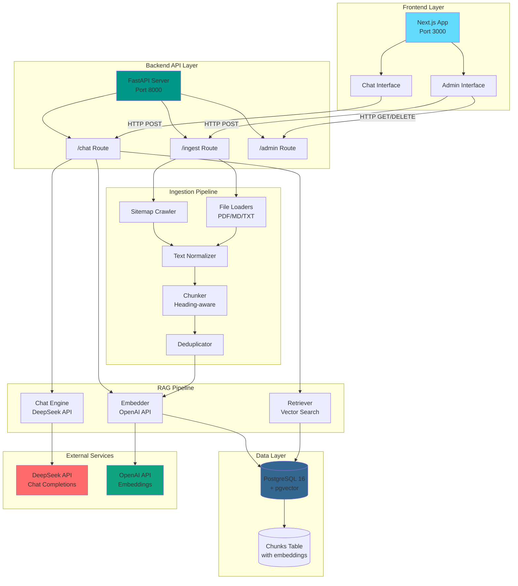
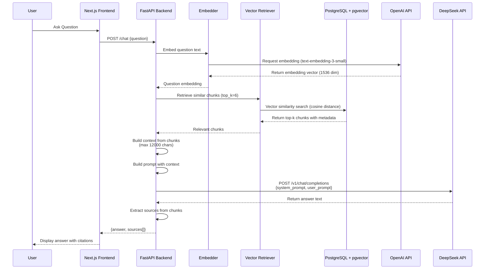
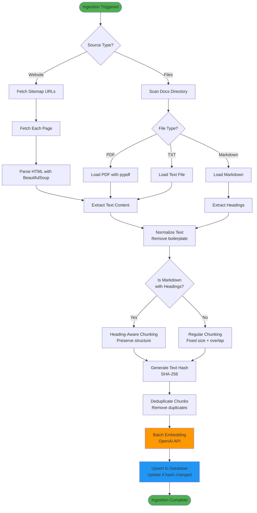
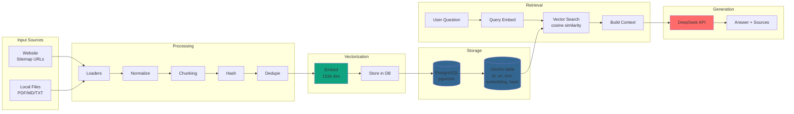

# Tech Stack Analysis

## Technology Stack Overview

### Backend Stack

| Category | Technology | Version | Purpose |
|----------|-----------|---------|---------|
| **Runtime** | Python | 3.10+ | Backend programming language |
| **Web Framework** | FastAPI | ≥0.110.0 | REST API framework with async support |
| **ASGI Server** | Uvicorn | ≥0.23.0 | ASGI server for FastAPI |
| **Data Validation** | Pydantic | ≥2.0.0 | Data validation and settings management |
| **Database ORM** | SQLAlchemy | ≥2.0.0 | ORM for database operations |
| **Database Driver** | psycopg | ≥3.1.0 | PostgreSQL adapter |
| **Vector Database** | pgvector | ≥0.2.5 | PostgreSQL extension for vector similarity search |
| **Database** | PostgreSQL | 16 | Primary database with vector support |
| **LLM Client** | OpenAI SDK | ≥1.30.0 | OpenAI-compatible API client (supports DeepSeek) |
| **Embeddings** | OpenAI Embeddings | text-embedding-3-small | Text embedding model (1536 dimensions) |
| **Chat LLM** | DeepSeek API | deepseek-chat | Chat completion model |
| **Web Scraping** | BeautifulSoup4 | ≥4.12.0 | HTML parsing and extraction |
| **XML Parser** | lxml | ≥5.0.0 | XML/HTML parsing for sitemaps |
| **HTTP Client** | requests | ≥2.31.0 | HTTP requests for API calls |
| **PDF Processing** | pypdf | ≥4.0.0 | PDF text extraction |
| **Tokenization** | tiktoken | ≥0.7.0 | Token counting and text processing |
| **Environment** | python-dotenv | ≥1.0.0 | Environment variable management |
| **Containerization** | Docker Compose | - | Database containerization |

### Frontend Stack

| Category | Technology | Version | Purpose |
|----------|-----------|---------|---------|
| **Framework** | Next.js | 14.0.0 | React framework with App Router |
| **UI Library** | React | 18.2.0 | UI component library |
| **Language** | TypeScript | 5.3.0 | Type-safe JavaScript |
| **Styling** | Tailwind CSS | 4.0.0+ | Utility-first CSS framework |
| **UI Components** | shadcn/ui | - | Component library (Radix UI based) |
| **Radix UI** | @radix-ui/react-slot | 1.0.2 | Unstyled, accessible UI primitives |
| **Radix UI** | @radix-ui/react-dialog | 1.0.5 | Dialog component |
| **Icons** | lucide-react | 0.294.0 | Icon library |
| **Styling Utils** | class-variance-authority | 0.7.0 | Component variant management |
| **Styling Utils** | clsx | 2.0.0 | Conditional class names |
| **Styling Utils** | tailwind-merge | 2.0.0 | Merge Tailwind classes |
| **Build Tool** | PostCSS | 8.4.0 | CSS processing |
| **Build Tool** | @tailwindcss/postcss | 4.0.0+ | Tailwind v4 PostCSS plugin (includes autoprefixer) |

### Development Tools

| Category | Technology | Version | Purpose |
|----------|-----------|---------|---------|
| **Testing (Backend)** | pytest | ≥7.4.0 | Python testing framework |
| **Testing (Backend)** | pytest-asyncio | ≥0.21.0 | Async test support |
| **Testing (Backend)** | pytest-cov | ≥4.1.0 | Code coverage |
| **Linting (Backend)** | ruff | ≥0.1.0 | Fast Python linter |
| **Formatting (Backend)** | black | ≥23.0.0 | Code formatter |
| **Type Checking (Backend)** | mypy | ≥1.5.0 | Static type checker |
| **Testing (Frontend)** | Jest | 29.7.0 | JavaScript testing framework |
| **Testing (Frontend)** | @testing-library/react | 14.1.0 | React component testing |
| **Testing (Frontend)** | @testing-library/jest-dom | 6.1.0 | DOM matchers for Jest |
| **E2E Testing (Frontend)** | Playwright | 1.40.0 | End-to-end testing |
| **Linting (Frontend)** | ESLint | 8.54.0 | JavaScript/TypeScript linter |
| **Package Manager (Frontend)** | npm/pnpm | - | Dependency management |

### Infrastructure & Services

| Category | Technology | Purpose |
|----------|-----------|---------|
| **Container Runtime** | Docker | Containerization |
| **Orchestration** | Docker Compose | Multi-container orchestration |
| **Vector Store** | pgvector (PostgreSQL) | Vector similarity search |
| **External API** | DeepSeek API | LLM chat completions |
| **External API** | OpenAI API | Text embeddings |

## Architecture Diagrams

### System Architecture Overview

### Chat Flow Sequence Diagram

### Ingestion Pipeline Flow

### Data Flow Architecture

## Key Design Patterns

### 1. **RAG (Retrieval Augmented Generation)**
- **Embedding**: Convert text to vectors using OpenAI embeddings
- **Retrieval**: Semantic search using pgvector cosine similarity
- **Generation**: LLM generates answers from retrieved context

### 2. **Provider Abstraction**
- OpenAI-compatible API client supports multiple providers (OpenAI, DeepSeek)
- Configurable via `OPENAI_BASE_URL` and `LLM_PROVIDER` environment variables

### 3. **Incremental Updates**
- Text hashing (SHA-256) for change detection
- Upsert pattern: update existing chunks if hash changed, insert new ones

### 4. **Semantic Chunking**
- Markdown files: Heading-aware chunking preserves document structure
- Other files: Fixed-size chunking with overlap

### 5. **Deduplication**
- Hash-based deduplication before database insertion
- Prevents duplicate chunks in knowledge base

## Technology Decisions

| Decision | Rationale |
|----------|-----------|
| **FastAPI** | Modern async framework, automatic OpenAPI docs, type safety |
| **PostgreSQL + pgvector** | Mature vector database, ACID compliance, no separate vector DB needed |
| **Next.js App Router** | Modern React patterns, server components, built-in optimizations |
| **shadcn/ui** | Accessible, customizable components built on Radix UI |
| **DeepSeek for Chat** | Cost-effective alternative to OpenAI with good performance |
| **OpenAI for Embeddings** | High-quality embeddings, widely supported |
| **Heading-aware Chunking** | Preserves document structure, improves retrieval quality for markdown |

## Deployment Architecture

```mermaid
graph TB
    subgraph "Development"
        DevFrontend[Next.js Dev Server<br/>localhost:3000]
        DevBackend[Uvicorn Dev Server<br/>localhost:8000]
        DevDB[Docker PostgreSQL<br/>localhost:5432]
    end
    
    subgraph "Production (Potential)"
        ProdFrontend[Vercel/Next.js<br/>Static + SSR]
        ProdBackend[Cloud Run/Railway<br/>FastAPI]
        ProdDB[Managed PostgreSQL<br/>+ pgvector]
    end
    
    DevFrontend --> DevBackend
    DevBackend --> DevDB
    
    ProdFrontend --> ProdBackend
    ProdBackend --> ProdDB
    
    style DevFrontend fill:#61dafb
    style DevBackend fill:#009688
    style DevDB fill:#336791
    style ProdFrontend fill:#000000
    style ProdBackend fill:#009688
    style ProdDB fill:#336791
```

